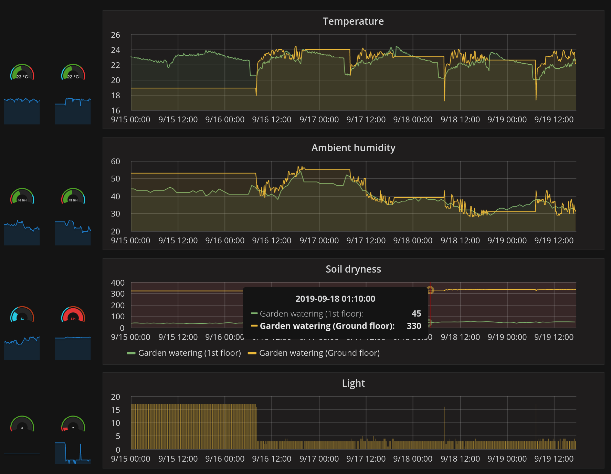

Higrow software
======

Adapted from https://github.com/eXtgmA/HiGrow/ with following changes:

* change code structure for Platform.io instead of Android IDE
* return json instead of html
* disabled mqtt and bluetoot stuff
* disabled the deep sleep features because deprecated (also it seems the device does not work well on battery)
* moved SSID and password to separate file `secrets.h`

Quick Start
---------

* Install platform.io
* `pio lib install`
* copy `include/secrets.h.sample` to `secrets.h` and fill in your wifi credentials
* flash the device:
  * adapt `platform.io` config, e.g. set `upload_port`
  * build and upload (on arch, no need to press a button or anything)

Hardware
---------

https://hackaday.io/project/25253-higrow-plants-monitoring-sensor

Note: there seem to be a new version of the board:

https://www.banggood.com/Wemos-Higrow-ESP32-WiFi-Bluetooth-Battery-DHT11-Soil-Temperature-And-Humidity-Sensor-Module-p-1196250.html

Software
------

* Prometheus for data collection
* Grafana for dashboard and alerting

